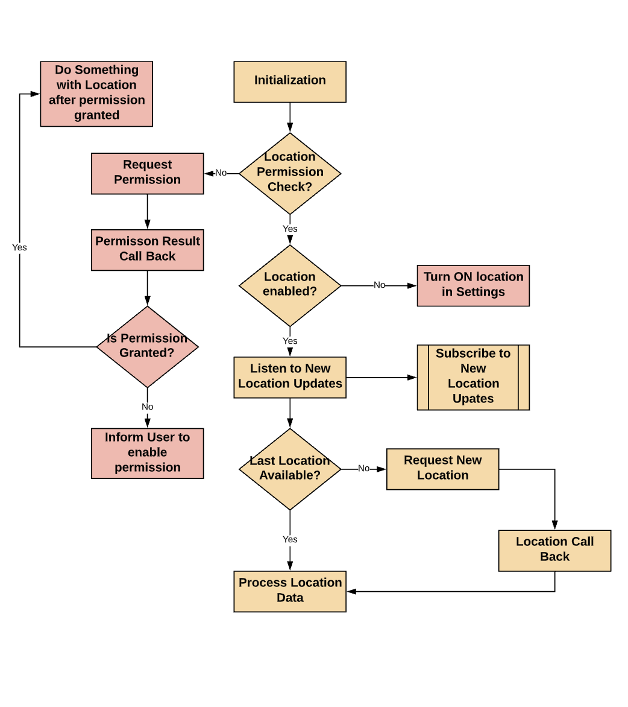

# Location Handling

## Introduction:

This project is created to understand the working of Location Handling using Fused Location API and also to have a ready made component for integration in the projects.

If you want to implement it straight away, you can make copy the handler in the project and jump to the Usage part.

---------------------------------------------------------------------------------------------------

## Installation:

Include the Following in Build.gradle to implement Fused Location.

```
implementation 'com.google.android.gms:play-services-location:17.0.0'
```

----------------------------------------------------------------------------------------------------

## Configuration:

Include the location Permission in Android Manifest XML

```
<uses-permission android:name="android.permission.ACCESS_COARSE_LOCATION"/>
<uses-permission android:name="android.permission.ACCESS_FINE_LOCATION"/>
```


----------------------------------------------------------------------------------------------------

## Coding Part - Handler:

There are three important section of this handler. (i) Permission & Access Handling (ii) Initialization and (iii) Consumption



### Permission & Access Handling

```
fun checkPermissions(): Boolean {

    if (ActivityCompat.checkSelfPermission(activity, android.Manifest.permission.ACCESS_COARSE_LOCATION) == PackageManager.PERMISSION_GRANTED &&
        ActivityCompat.checkSelfPermission(activity, android.Manifest.permission.ACCESS_FINE_LOCATION) == PackageManager.PERMISSION_GRANTED){
        return true
    }
    return false

}
fun requestPermissions() {

    ActivityCompat.requestPermissions(
        activity,
        arrayOf(android.Manifest.permission.ACCESS_COARSE_LOCATION, android.Manifest.permission.ACCESS_FINE_LOCATION),
        PERMISSION_ID
    )

}
fun isLocationEnabled(): Boolean {

    var locationManager: LocationManager = activity.getSystemService(Context.LOCATION_SERVICE) as LocationManager
    return locationManager.isProviderEnabled(LocationManager.GPS_PROVIDER) || locationManager.isProviderEnabled(
        LocationManager.NETWORK_PROVIDER
    )

}
```

### Initialization

```
fun initiateLocationUpdates(activity: Activity,listener:LocationHandlerCallBacks)  {

    mFusedLocationClient = LocationServices.getFusedLocationProviderClient(activity)
    this.listener = listener
    this.activity = activity

    if (checkPermissions()) {
        if (isLocationEnabled()) {

            mFusedLocationClient.lastLocation.addOnCompleteListener(activity) { task ->
                var location: Location? = task.result
                if (location == null) {
                    requestNewLocationData(activity)
                } else {
                    Log.d("Location","Enabled")
                }
            }
        } else {
            Toast.makeText(activity.applicationContext, "Turn on location", Toast.LENGTH_LONG).show()
            val intent = Intent(Settings.ACTION_LOCATION_SOURCE_SETTINGS)
            activity.startActivity(intent)
        }
    } else {
        requestPermissions()
    }

}
```

### Consumption

```
fun getCurrentLocation(callback: (Location) -> Unit)  {

    if (checkPermissions()) {
        if (isLocationEnabled()) {
            mFusedLocationClient.lastLocation.addOnCompleteListener(activity) { task ->
                var location: Location? = task.result
                if (location == null) {
                    requestNewLocationData(activity)
                }  else {
                    callback(location)
                }
            }
        } else {
            Toast.makeText(activity.applicationContext, "Turn on location", Toast.LENGTH_LONG).show()
            val intent = Intent(Settings.ACTION_LOCATION_SOURCE_SETTINGS)
            activity.startActivity(intent)
        }
    } else {
        requestPermissions()
    }


}
fun requestNewLocationData(activity: Activity) {

    var mLocationRequest = LocationRequest()
    mLocationRequest.priority = LocationRequest.PRIORITY_HIGH_ACCURACY
    mLocationRequest.interval = 0
    mLocationRequest.fastestInterval = 0
    mLocationRequest.numUpdates = 1

    mFusedLocationClient = LocationServices.getFusedLocationProviderClient(activity)
    mFusedLocationClient!!.requestLocationUpdates(
        mLocationRequest, mLocationCallback,
        Looper.myLooper()
    )

}
val mLocationCallback = object : LocationCallback() {

    override fun onLocationResult(locationResult: LocationResult) {
        var mLastLocation: Location = locationResult.lastLocation
        listener.onNewLocation(mLastLocation)
    }

}
```


----------------------------------------------------------------------------------------------------

## Usage Part

### Initialize the location Handler by invoking Handle Location and Subscribe to new location Updates

```
fun handleLocation() {

    //Initialization
    val locationListener = object : LocationHandlerCallBacks {
        override fun onNewLocation(location: Location) {
            processNewLocationUpdate(location)
        }
    }
    locationHandler.initiateLocationUpdates(this,listener = locationListener)

    //Get the current Location - on demand
    locationBtn.setOnClickListener {
        val currentUserLocation = locationHandler.getCurrentLocation { location ->
            Toast.makeText(this,location.latitude.toString(), Toast.LENGTH_SHORT).show()
            //TODO: - Process Location data
        }
    }

}
fun processNewLocationUpdate(location:Location) {
    Log.d("New Location", location.latitude.toString())
    //TODO: - Process New Location data
}
override fun onRequestPermissionsResult(requestCode: Int, permissions: Array<String>, grantResults: IntArray) {

    if (requestCode == 42) {
        if ((grantResults.isNotEmpty() && grantResults[0] == PackageManager.PERMISSION_GRANTED)) {
            Toast.makeText(this,"Granted", Toast.LENGTH_SHORT).show()
            //TODO: - Handle Permission - Positive Case
        } else {
            Toast.makeText(this,"Rejected", Toast.LENGTH_SHORT).show()
            //TODO: - Handle Permission - Negative Case
        }
    }

}
```


### Check out my Post about Location Handling : [Location Handling](https://vijaysn.com/mobile/android/android-fused-location)
